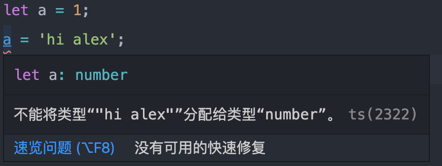

# 特点

1. 静态类型语言
2. 是JS的超集
3. 不能直接运行，需要编译成JS才能在浏览器执行

相对于JS的优势：

1. 更好的错误提示
2. 更好的编辑器语法提示
3. 代码语义更清晰易懂

```text
// ts 静态类型
let a = 1;
a = "hi alex";  // wrong
```



```text
// js 动态类型
let a = 1;
a = "hi alex";
```


